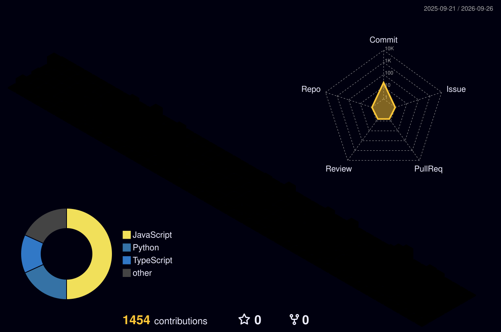

<!-- ===================== HEADER ===================== -->
<h1 align="center">Sahil Salaria</h1>

<p align="center">
  <a href="https://github.com/Sahilsalariasoftradix">
    
  </a>
</p>

<p align="center">
  
  
  
  
</p>

<p align="center">
  <a href="https://github.com/Sahilsalariasoftradix/Sahilsalariasoftradix/issues/new?template=project-enquiry.yml">
    
  </a>
  
</p>

---

## About

I run delivery at **Softradix Technologies**, working across mobile, web, backend, AI and QA teams.

My day is scoping and estimating new work, keeping active builds on track, writing the documents that hold a project together (FSDs, work orders, release notes, client updates), and making sure what ships is what was agreed.

I came into this role through QA. Four years of testing before managing meant I learned where builds break, which is now how I read a scope document before anyone writes a line of code.

**What I actually do:**

- Requirement analysis, scoping and effort estimation
- Sprint planning, milestone tracking and release coordination
- Client communication: weekly updates, call summaries, escalations
- Technical documentation: FSDs, work orders, test plans, audit reports
- Risk management and scope-gap detection before it becomes a dispute
- Driving AI-assisted development adoption across the team

---

## Delivery Track Record

<details open>
<summary><strong>Products shipped and live</strong></summary>
<br/>

| Product | Domain | Stack | Platforms |
| :-- | :-- | :-- | :-- |
| **UBuild** | Construction ecosystem, India | Flutter · NestJS · React · Firebase | iOS · Android · Admin |
| **FlippBidd** | Real estate investment, US | Flutter · React · Node.js · Firebase | iOS · Android · Web |
| **Pulmify** | Medical professional network | Base44 · Cross-platform | iOS · Android |
| **Chickasaw Emoji** | Language preservation | Native Android | Android |
| **Lingofix** | German grammar keyboard | Flutter · Swift · Kotlin · Rust FFI | iOS · Android |
| **IAM Wellness** | AI wellness assistant | Django · Celery · Qdrant · GPT-4o | Web |
| **Unscammed AI** | Voice scam detection | VAPI · Twilio · OpenAI · Playwright | Web |
| **BookEase** | Appointment booking SaaS | React · Node.js | Web |

</details>

<details>
<summary><strong>Also delivered</strong></summary>
<br/>

Two Strikers Baseball · TheITIN · NH Management · In2Touch · Art Quest · Teni Travel · Inspection Doctor · Car Show App · SummarizeX · DrinkMate · Quote That · Digital Truth · Telecey · Ren Athletics · Prime Trainer · GluCare · Medini · Salude Beauty Spa · Kudrat Welfare Trust (pro bono)

</details>

---

## How I Work

| Principle | In practice |
| :-- | :-- |
| **No surprises** | Weekly written update to every active client, Friday EOB. Call summary within an hour. |
| **Scope gaps early** | Every requirement gets read for what is missing, not just what is written. |
| **Nothing quoted cold** | Estimates go through the dev team and internal review before they reach a client. |
| **Documentation is delivery** | If it is not written down, it is not agreed. |
| **AI where it compounds** | Claude Code and Cursor for scaffolding and form-heavy work, humans on architecture and data models. |

---

## Working Landscape

**Mobile**  


**Web and Backend**  


**Data and Infra**  


**QA, Tools and Design**  


<p>
  
  
  
  
  
  
</p>

---

## Path So Far

```text
2022  QA Trainee          Learning how software actually breaks
2023  QA Analyst          Owning test cycles across mobile and web
2024  QA Team Lead        Running QA for the full product portfolio
2026  Project Manager     Owning delivery, clients and cross-functional teams
```

---

## GitHub Activity

<!-- Theme-aware: images swap automatically for viewers on light vs dark GitHub -->
<div align="center">

<!-- Snake: eats the contribution grid -->
<picture>
  <source media="(prefers-color-scheme: dark)" srcset="https://raw.githubusercontent.com/Sahilsalariasoftradix/Sahilsalariasoftradix/output/snake-dark.svg" />
  <source media="(prefers-color-scheme: light)" srcset="https://raw.githubusercontent.com/Sahilsalariasoftradix/Sahilsalariasoftradix/output/snake.svg" />
  
</picture>

</div>

<details>
<summary align="center"><strong>More activity views</strong></summary>
<br/>
<div align="center">

<!-- Isometric 3D contribution calendar, built by GitHub Action -->
<picture>
  <source media="(prefers-color-scheme: dark)" srcset="./profile-3d-contrib/profile-night-rainbow.svg" />
  <source media="(prefers-color-scheme: light)" srcset="./profile-3d-contrib/profile-green-animate.svg" />
  
</picture>

<br/>

<!-- Contribution activity over time -->


<br/>

<!-- Metrics infographic, built by GitHub Action -->


<br/>


</div>
</details>

---

## Work With Me

Scoping a build, need a delivery review, or want a second read on a requirement document before it turns into a dispute? Open an enquiry and I will reply there.

<p align="center">
  <a href="https://github.com/Sahilsalariasoftradix/Sahilsalariasoftradix/issues/new?template=project-enquiry.yml">
    
  </a>
</p>

---

## Connect

<p align="left">
  <a href="https://www.linkedin.com/in/sahil-salaria/">
    
  </a>
  <a href="mailto:Sahil@softradix.com">
    
  </a>
  <a href="mailto:sahilsalaria811@gmail.com">
    
  </a>
  <a href="https://www.softradix.com">
    
  </a>
</p>

<p align="center"><i>Open to conversations about product delivery, QA process, and shipping AI-assisted software that holds up in production.</i></p>